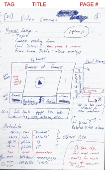

## The Act

You should be keeping an Idea Notebook.
This can be a physical notebook, which I prefer,
or some note taking program on your smart devices.
Whatever it is, it should always be with you.
You never know when you are going to have a great idea!

This notebook should allow you to express yourself
as well as possible.
For me, that means lined and dotgrid paper,
which the
[Penny Arcade First Party notebooks](http://store.penny-arcade.com/products/first-party-notebook-set)
provide.

Once you have this, record your ideas all the time.
Some people get a nice notebook,
then are afraid to write anything in it.
Physical and digital pages are cheap.
Don't be afraid to write down your ideas!

I have also found that using things like
page numbers and category tags on pages
works well.
You will want to come back to your ideas
to modify or delete them.

Here is a scan of one of my idea notebook pages.
I annotated it a bit, pointing out
the metadata I add to the top of my pages.

## The Inspiration

When you are trying to come up with new ideas
for projects or approaches,
it can be helpful to find different
sources of inspiration.

**Solving a personal need**
is the single largest source of
my personal idea inspiration.
I encounter many frustrations with
existing solutions to problems
and come up with ideas that they could be better.

**Working with new people**
can be incredibly inspiring.
Try to reach out beyond your current team at work.
Pair with people in the greater community
at meetups or virtually.

**Meeting people outside of the industry**
can open up all kinds of ideas
you would have never thought about.
Try not to insulate yourself with
only friends from the industry.

## The Failure

Sometimes you can't think of anything good
and that's ok!
Generating ideas is a process
that requires creating connections in your brain.
You won't know ahead of time which connections
will turn into awesome ideas.
So, your best bet is to create as many connections
as possible.

If you aren't having any luck,
sometimes not thinking about anything
can allow your mind to work on problems
in an asynchronous manner.
Try going for a run,
sitting outside,
or otherwise taking a break
from intense conscious thought.

## The Success

When you have an idea, what makes it great?
The great ideas are those you are excited about.
The best ideas are those that you can get others excited about.
It's one of those "you'll know" moments.

Once you have a great idea,
you should test it as soon as possible.
This could be talking about it to friends,
building a small prototype,
or working through the use cases.

Share your methods of idea generation below!
