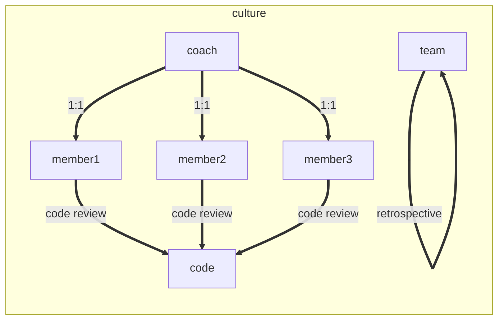

<!--

- what do you do about bad coaches?
- essential retrospectives vs. formative retrospectives
- essential code reviews -> formative code linting and analysis (data used in formative retrospectives)
- hiring: https://sockpuppet.org/blog/2015/03/06/the-hiring-post/
- hiring: https://modelviewculture.com/issues/hiring
- being a senior engineer: http://www.kitchensoap.com/2012/10/25/on­being­a­senior­engineer/
- expand further reading appendix
- development plan example: http://www.construx.com/Resources/Developer_Professional_Development_Plan/

quotes:

  Position: ­ A position has a job title and associated list of responsibilities, skills and required behaviors. We group positions both by functional path and tier / level. These can be seen on the Career Ladders grid below.

  Role: ­ A role is a specific set of responsibilities that are grouped into one overall theme. People in multiple positions may play the same role. Likewise, someone in one position may play multiple roles. Most positions have mandatory roles (e.g. many positions require the Developer role, an Engineering Manager always plays the People Manager role.)

-->


<div class="author-note">
  This intro definitely needs revision.
  I definitely want to start out identifying that process is a bad word, then
  explain why I think it's just misrepresented.
</div>

Often when talking about process, small companies like to say they don't have much of it because they don't need it. I think it's fairer to say that all companies have process, small ones just don't often write it down or talk about it. Documenting your processes can help your team make sure everyone has a shared understanding of what the process is. At smaller companies, it's less likely for the shared understanding to vary. So yes, in small companies, the need to document your processes may be less.

But then the company grows.

Maybe it starts with more engineers. You pull from your professional and social networks. You find people who are similar to you in many ways and the acclimate to the company and its undocumented processes without too much trouble.

But then you add an entirely new skillset. This could be your first mobile app engineer, designer, marketer, salesperson, or whatever else you need. The farther you get from your close networks and your existing domains, the farther you get from being able to rely on an ad-hoc, shared understanding of your processes.

It's time to figure out what these processes should be and make sure the entire company knows what they are.


### Axioms of Culture (Core Values)

<div class="author-note">
  The axiom talk probably isn't helping me avoid the "formal process, ugh" mindset, is it?
  I was thinking about adding a silly element to this content, such as The Process Pirate
  who interjects when things get too corporate sounding and somehow explains that the current subject
  is actually a good thing.
  <br><br>
  Like here, mentioning "core values", could have a callout element that looks like a video game chatbox
  (complete with avatar of the process pirate) that says something like "Core Values? Bah! I think you mean the crew
  just needs to make sure they are on the same parchment with regards to the kinds of treasure they like." You get the idea.
</div>

No set of processes will be successful if they violate your team's core values.

In general, culture is something you should be intentional about curating. You won't be able to control it completely, but the team members and especially the leaders need to care about it and live their values. Your organization's culture will be unique to the people in it, but there are a couple core values you should include for the processes described here to be effective.

The processes described here rely heavily on these core values:

**Core Value "Inclusion":** An inclusive organization is one that goes out of its way to ensure that team members from many different backgrounds, experiences, skill sets, mind sets, physical abilities, and other differences among humans are welcome and supported. Team members cannot fear for their right to exist in your space.

**Core Value "Transparency":** Continuous feedback requires that appropriate feedback is actually provided. The team needs feel comfortable providing real and honest feedback to each other. Making this part of your culture allows you to have conversations about (for example) how team members prefer to receive constructive feedback. 


## Process

Now that we have the core values of Inclusion and Transparency, we can build up our processes. The goal here is to provide systems of feedback that remove as much influence from bias as possible.

Even though they fit together well, you should fee free to pick and choose the processes that solve a problem you have and meet your needs.


### Axioms of Process

These axioms can be your core assertions upon which you can build all other processes.

**Sufficient:** Process should always be just as much as you need, no more. Not defining "need" here allows you to wiggle up or down, but when you identify some process that's not working for you, by all means change or remove it!

**Freedom:** Process should free you from the responsiblity of making the numerous small, consistent decisions of day-to-day and week-to-week work. They can relieve [Decision Fatigue](https://en.wikipedia.org/wiki/Decision_fatigue), leaving time and energy to focus on what matters most. Process is a great way to make default decisions.

**Simplicity:** If the process is complicated, it will have more friction for people to remember and follow it. A complex process can actually introduce more small decisions or strain your memory. It can also mean that your organizational structure or priorities could use some work.


### Layers of Process

There are a few categories of process that are important to understand: Essential, Formative, and Augmentative.

**Essential Process:** All (software) companies of all sizes should be following these processes.

**Formative Process:** Most (software) companies of an established form should have a process that addresses the same problems, but they don't necessarily have to be in this form. "Established form" here means that you are larger than a handful of people and have at least a clear short-term product goal.

**Augmentative Process** Most (software) companies of an established form should also apply their formative processes to their recruitment efforts. There's a striking parallel drawn between the two, which can provide a lot of benefits.

All processes described here are focused on building tight systems of feedback for many aspects of running a business, including recruiting, communication, employee performance, and team performance.

Beyond these suggested processes, companies will have other processes specific to them. These should also try to have built in systems of feedback.

Note: These are effective guardrails for continuous improvement. Everyone will benefit by having these in place. However, self-motivated team members will still excel in this world.


### Axioms of Feedback

Regardless of how well your team currently operates,
it can always make progress towards being better.

Those are the kinds of teams I want to build and be a part of.
I love working with people of varying experience and skill level,
but we should all share this assumption that we're continuously working
to improve.

To accomplish this, we need systems of feedback.

A System of Feedback is one that produces feedback that is appropriate, specific, kind, actionable, and timely.

**Appropriate:** Feedback must be specific to a failure to meet a known expectation. If it's not, then your feedback is really about the expectations themselves, not meeting them. Shared understanding of expectations is key and can be facilitated by generating and maintaining a Roles and Responsibility document.

**Specific:** Feedback must be clear about what you expected to happen and what actually happened. This works best with clear examples.

**Considerate:** Feedback should assume the best of intentions, a different perspective where the team member’s actions make sense, and be empathetic to the fact that criticism can trigger defensiveness instead of the desire to improve. However, feedback must also not be overly couched. It must still be very clear that improvement is requested.

**Actionable:** Feedback should be actionable. When giving feedback, consider how the team member can take steps to improve. If you can’t think of any, your feedback may not be actionable.

**Timely:** Feedback should be given continuously, but not constantly. Different systems will have different ideal timings, but they all need a tight feedback loop. This reduces the impact of recency and negativity biases.


### Processing Feedback

Feedback for any system should be considered carefully. For some metrics, any downturn might be cause for alarm. For many, however, what really matters is a trend over time.

Feedback is also not always correct. Your tests, gathering systems, indicators, or the feedback itself may just be wrong. Don't blindly accept feedback.


## Series: Essential, Formative, and Augmentative Process

Now that we have our cultural, process, and feedback axioms, we can proceed to the processes themselves!

- Culture Axioms
    - Inclusion
    - Transparency
- Process Axioms
    - Sufficient
    - Freedom
    - Simplicity
- Feedback Axioms
    - Appropriate
    - Specific
    - Considerate
    - Actionable
    - Timely

This series will cover many aspects of running an organization. Feel free to use any of it as a starting point for your own processes or use it as-is.

Feedback is always welcome! Please send it to [@endangeredmassa](https://twitter.com/endangeredmassa) or [endangeredmassa@gmail.com](mailto:endangeredmassa@gmail.com).


```txt
Essential, Formative, and Augmentative Process

1. Essential Processes: Continuous Improvement of Teams, Members, and Code
1.1. Retrospectives
1.2. 1:1s
1.3. Code Review

2. Formative Processes
2.1. Roles & Responsibilities
2.2. 1:1 Check-in
2.2. Performance Review
2.3. Performance Assessment
2.4. Compensation Determination
2.5. Letting People Go

3. Augmentative Processes
3.1. Job Descriptions (Roles and Responsibilities)
3.2. Interviews (Performance Review)
     - Colleague References (Peer Feedback)
3.3. Debriefs (Performance Assessment)
3.4. Offers (Compensation Determination)
3.5. Rejections (Letting People Go)
```


# 1. Essential Processes: Continuous Improvement of Teams, Members, and Code

These are the essential processes that all companies need to be successful. They are based on an agile premise of tight feedback loops providing better outcomes. I think it's unreasonable to expect something to improve without strong feedback loops.

> A Minimally Effective Team is one that has systems of feedback generating continuous improvement of the team, its members, and its code.

Those minimal systems are retrospectives, 1:1 Check-ins, and Code Review.




## 1.1  Retrospectives

The core concept of a Retrospective is that a team looks back over a recent period of time to talk about what worked well and what didn't. Too many teams will follow this vague guidance and/or follow a prescribed format, missing out the immense value this meeting can provide.

A Retrospective is the most important mechanism for producing continuous improvement of your team. It's the default discussion framework for team-wide concerns any member has. It's the forcing function that holds the team accountable for improvement. It's a team bonding experience over honesty, introspection, and helping each other. It is, in fact, everything.


### Format

There are a few formats that teams use for Retrospectives, but the key components are:

- things we're doing well
- things we're not doing well
- what we're going to do about the things we're not doing well

If your favorite format includes those three things, then go for it. If you don't have a favorite format, then just use those three things as a starting point.

```
Good
====

- something good


Bad
===

- something bad


Action Items
============
- [someone] do something about the bad thing
```

Typical sprint-based agile teams will have a retrospective at the end of each sprint. That's fine as long as your sprints are not longer than 4 weeks. If they are, consider having a mid-sprint retro.

Retrospectives even at a 1-week period can be worth it, but a starting point of 2 weeks is pretty common and effective.

### Formative Format

It's time for more inputs and better outputs!

#### Metrics!

You can start collecting data about how well your team is performing and how well your code is written over time. The trends of this data should be reviewed in Retro with clear expectations of how the team should respond to "trending high in cyclomatic complexity", for example.

- Organization (OKR, etc.) Metrics
- Team Metrics:
  - velocity
  - time to complete tasks
  - average team happiness
- Code Metrics:
  - cyclomatic complexity
  - cognitive complexity
  - churn


#### Experiments!

// TODO: this looks like OKRs, a bit

When you decide to try a solution to a problem discussed in retro, you may not be confident that the solution will actually solve the problem. This is the perfect time to set up a team experiment!

Experiments are just what they sound like: You decide on your hypothesis, how you are going to test it, and what you are going to measure to determine if it was successful. Experiments should be assigned just like action items. The data for all active experiments can then be reviewed in Retro.

If an experiment seems to have failed, you can stop doing whatever test was involved and try something else. If it was successful, you can close the experiment and continue with your new process!


## 1.2. 1:1 Check-ins

The 1:1 Check-in is a periodic meeting between a Coach (a role often played by a Manager) and a Team Member. The purpose is to provide a "check in" point where a coach can help guide a team member on their career path or navigate social conflict.

These should happen pretty often after someone joins the team, probably weekly. After a time, they can happen less often, but at least once every 3 weeks is best. This could also very from person to person.

Initial 1:1 Check-ins should be focused on establishing a baseline of how the team member prefers to:

- communicate
- receive praise
- receive feedback
- express frustrations

Future 1:1 Check-ins should focus on:

- feedback delivery from other team members
- feedback gathering for other team members
- goal tracking updates
- conflict resolution
- career path tracking updates
- pointed questions about the team, members, or code


### Delivering Feedback

When delivering appropriate feedback to a team member, make sure that bring supporting evidence, if possible. Many people will want to see specific examples of behaviors that require changing.

For example: Someone has complained about the picky nature of a team member's pull request comments. The coach deemed that it was appropriate feedback based on the Roles and Responsibilities document for Software Engineers. Before delivering that feedback to the team member, the Coach looks up recent code reviews and saves some examples of what can be considered too picky for code review comments. When the coach delivers the feedback to the team member, they can then have a clear discussion based on examples.


## 1.3. Code Review

All code changes should at least be reviewed by one other person. It's really easy to miss something and deploy a bug to production.

Code reviews can't be rubber stamp systems, either. They are a very useful tool for preventing bugs, teaching others, learning, and challenging assumptions.


# 2. Formative Processes: Career Development

These processes put structure around a Roles and Responsibilities document. This allows the team to have a clear expectations of each other.
This foundation allows the team to continuously provide meaningful feedback to each about members' performance.


## 2.1. Roles & Responsibilities

Your Roles and Responsibilities document is the keystone of the entire Formative Process set.
Without it, everything else falls down.

It should describe a set of roles that your company needs, each with a series of responsibilities that role is accountable for.
Responsibilities should include how the role communicates with other roles, what their primary and secondary tasks are, how well they should accomplish them, examples of them.

You probably already have an idea of what your CEO, CTO, Director of Sales, Web Software Engineer, Mobile Software Engineer, etc. mean. I suggest using industry terms where possible because they will convey some information without explanation, but you should also feel free to deviate when necessary. Roles are also not Titles. The title of Software Engineer means the primary kind of work the person will be doing is directly related to writing software. The role Software Engineer means that the team member is responsible for work related to writing software, but they may also have other roles and therefore other responsibilities. One person can have multiple roles, but be mindful of how much of that persons time will be spent on each role. Roles are also not permanent. If you are interested in Dynamic Reteaming, you may be rotating a Tech Lead role among team members.

To get a draft started, you can:

- write out the high-level bullet point responsibilities for each role
- try this exercise from the Atlassian Team Playbook entry for
[Roles and Responsibilities](https://www.atlassian.com/team-playbook/plays/roles-and-responsibilities)
- use the Synthesized Roles and Responsibilities document provided below

After you have your draft, have a team discussion about it and correct any inaccuracies. This is a living document. Make sure you are using Retrospective meetings revise it.

### Synthesized Roles and Responsibilities

Industry jargon around what the roles and responsibilities are varies, but there are common elements. I've collected over a dozen such documents from large tech companies so that I could synthesize them into a common starting point.

You can use this as your starting point or as your own official Roles and Responsibilities document. Whatever works for you!


### Ladder System

You might think that Roles and Responsibilities documents are great, but aren't sure if you should be listing Senior Software Engineer as a separate role or how someone should move from Software Engineer to Senior Software Engineer. You might worry that you are paying team member inconsistently within the organization and/or out of tune with the industry. You may lack transparency about how team members are compensated and promoted, causing confusion.

If so, this section is for you!

The premise is that a Roles and Responsibilities document can be expanded to include levels of expertise in each role as well as direction for how to progress to the next level.


## 2.2. 1:1 Check-in

A 1:1 Check-in is a meeting between a coach and the team member they serve. The goal of the meeting is to check in on how the team member is feeling about work, review specific situations that came up, and to gather feedback about other team members.

Coaches should use this time to really listen to the team member. Team members should use this time to express their highs and lows of working at the company. Both coaches and team members should prepare for 1:1 Check-ins.

In order to combat recency bias, the period of check-ins should not exceed 1 month. Different situations will require more frequent check-ins. Onboarding new hires and resolving tense issues are a couple of examples where you may want weekly check-ins.


### Structure

The coach or team member should provide updates on any relevant goals or Key Performance Indicators (KPIs).

The team member should provide new feedback for other team members. The coach should use this time to prompt the team member about recent interactions or for other team members who need more feedback.

The coach should provide any relevant feedback to the team member.

All notes from these meetings should be kept for reference during the next Performance Review in a document shared only between the coach and the team member.


## 2.2. Performance Review

A Performance Review is where employees’ performance is reviewed against their roles for the purpose of providing concise, constructive feedback.

### Reviewing Others

The goal is to provide a few really actionable bits of feedback to another team member that direct them towards being better at their job as defined by the Roles and Responsibilities document.

Every review period, we’ll do:

- Department Peer Reviews (devs review devs, design reviews design, sales review sales, etc.)
- Active Project Member Reviews (everyone on a project reviews everyone else on a that project)
- Leadership Review (every employee reviews their manager, all the way up to the CEO)

This may mean that you have to review someone more than once, but possibly in different roles. Please review each person-role combination at least once.

When reviewing, please think about how to best give your feedback. See Giving Feedback.

### Review Form

The review form itself will be specific to a role. A reviewer may review the same team member multiple times, once per relevant role they played.

### Performance Review Meeting

After all reviews have been collected by your manager, it will be synthesized into actionable feedback. Then a meeting will be scheduled by your manager with you to discuss that feedback.

The meeting itself should involve the following:

**Reviewing Feedback:** Review each item of feedback with the team member. For each item, determine if it is appropriate, specific, and actionable. If you agree that it is, determine how behavior might change to address the feedback. Determine if a goal is useful for correcting that behavior. (See Goal Setting.)

**Reviewing Goals:** Review all current and new goals that the team member has. For each item, make sure that it is directing the team member towards better performance of their roles’ responsibilities. Remove any goals that are no longer useful.

**Distribute Results:** Provide the team member with a printed set of feedback and a documented set of updated goals.


## 2.3. Performance Assessment

In order to assess a team member’s performance, the manager gathers all data available. Following the rest of the Formative Processes should provide the manager with most of the following:

- 24+ Continuous Employee Surveys
- 6x 1:1 Check In Meeting Notes
- goal progress
- granular and immediate feedback from others
- 1+ Project Performance Review Summaries
- 1+ Active Project Review Summaries
- 2x (Quarterly) Performance Review Summaries

That data should be used to assess the level of accomplishment by the team member on each of the responsibility items in the roles that they played as defined by the Roles & Responsibilities document.

Note that “number of goals met” is NOT a measure of performance. Goals are just a tool. Assessment should always be based on responsibilities.


## 2.4. Compensation Determination

By the time the compensation adjustment discussion is happening, there should already be a shared understanding between the company and the team member about how well they are doing at their roles. You will have already discussed Performance Review results and Performance Assessment results.

There will be a baseline adjustment for most team members. (Those who recently joined or those who are not meeting their expectations may not receive this adjustment.) This adjustment will be based on cost of living changes as well as overall performance of the company.

Based on the team member’s Performance Assessment, an adjustment will be made to their compensation. If you use a ladder system with fixed compensation levels, you will only change compensation when someone moves up a level.

If anyone believes that the current fixed compensation at a specific level no longer represents the company's compensation goals (for example, being above market value), then they can start a conversation about adjusting it. This conversation is not about specific people deserving more compensation. Instead, it's about specific roles deserving more compensation.


## 2.5. Letting People Go

- explain: system for getting rid of poor performers; everyone's already on a performance improvement plan

In your typical workplace, under-performing team members will be put on performance improvement plans supposedly in an attempt to get them up to expectations. However, this is often code for "we want to fire you soon". Under the system described here, everyone is already on a performance improvement plan. Why wouldn't you want everyone ot have clear direction on how to improve?

Well, one reason is cost. It takes a lot of energy to do this well.


# 3. Augmentative Processes: Recruiting

If you look at recruiting through a performance assessment lens, you realize that you are trying to do the same thing: you want to figure out how well an employee or candidate performs some role. With some adaptation for this other context, we can take advantage of many of our Formative Processes.

This has many benefits:

- consistency of candidate to employee experience
- consistency of facilitator's experience running both systems
- transparency of expectations
- more data for candidates to opt out, if they like

We'll explore the following processes based on their formative equivalents:

- Job Descriptions based on Roles and Responsibilities
- Interviews based on Performance Review
- Interview Debriefs based on Performance Assessment
- Making Offers based on Compensation Determination
- Sending Rejections based on Letting People Go


## 3.1. Job Descriptions (Roles and Responsibilities)

Job Descriptions are analogous to Roles and Responsibilities. It's a description of the roles you expect someone play and what those responsibilities will be. The job description will need to include some things beyond that, but the core concepts are the same.

// TODO: what do job descriptions need?


### Deciding What Roles You Need

When you have Roles and Responsibilities defined, even more so when you have a full Ladder System, it becomes easier to talk about the roles you need on your team. You may, for example, have a team of three Software Engineer Level 3s and two Software Engineer Level 5s on your team.

You consider hiring a more junior person to the team: According to your role definitions, levels 1 and 2 require a fair amount of supervision and guidance. Given your team size (5) and it's relative seniority (several 3s and a couple 5s), you feel confident that you can provide that level of supervision and guidance to a new junior team member without overly slowing down the velocity of the team.

You consider hiring a more senior person to the team: According to your role definitions, levels 4 and 5 are expected to be mentors and empower those around them. You have no levels 1 and 2 who could benefit from this and the 3s already have two 5s doing this kind of work. If you were to hire another level 4 or 5, you may be wasting the ability of the person to perform in this way. You may further be complicating their performance reviews because they may not have an opportunity to show this skill.

These are purely role-based considerations, though. There are other things to consider, such as budget and opportunity costs. What's right for you may vary, but focusing on the role first will give you a strong starting point.

### Deciding What Domains You Need

Object-oriented programming may be a skill you are looking for at a certain level, but specifically you may want that skill to be in the Ruby on Rails domain. Or, you may want someone who has experience writing systems in the educational technology domain. It's up to you how much emphasis you put on these requirements.


### Writing the Job Description

After you know what roles and domains you are looking for, you can start writing the job description.

- don't use biased language


### Sourcing

- not just from personal network
- note: no matter what you recruiting process is, you're always excluding someone and it's really hard to know who that is


## 3.2. Interviews (Performance Review)

- ask them how they want to be interviewed with a set of options
  - coding challenge
  - come in for a longer period of time
  - focus on specific areas of expertise; highlight their strengths instead of their weaknesses
- have each session focus on specific responsibilities the candidate's role is responsible for
- use scorecard assessments


## 3.3. Debriefs (Performance Assessment)

- just like in Performance Assessment, this isn't necessary a single discussion among the interviewing crew; if there's more information required, you can ask the candidate to provide another reference, code sample, or if possible, another interview session focused on that specific thing
e providing this document to the candidate will 


## 3.4. Making Offers (Compensation Determination)

Offers are pretty easily made if you use fixed compensation per level in your Ladder System.


## 3.5. Sending Rejections (Letting People Go)

Most places seem to give very little feedback to candidates out of fear of litigation for discriminatory hiring practices. With the rubric described here, we can provide structured feedback about what we were looking for and what we observed. In order to have a conversation with candidates about their assessed performance, we have to share this rubric with them anyway. In the case where we'd like to reject a candidate, that rejection should therefore carry little extra risk by including the final version of the rubric as a form of feedback.

Here's a set of things we were expecting and here's how well we could tell that you could do each of them. In each area that needed improvement, the candidate would then have some indication of where they could grow as an engineer and specifically where they should grow if they wish to interview again in the future.


# Appendix

## A. Roles and Responsibilities Example by Synthesis

TBD

<!--
### Chief Technical Officer

The CTO is responsible for making sure the company's technology strategy serves its business strategy.

There are several secondary responsibilities that must be completed in order to do the first:
- Making platform-level technology decisions
- Understanding the full scope of what the product can and cannot do
- Growing technical leaders
- Growing the development methodology
- Maintaining a technical vision
- Communicating technical concepts to non-technical teammates
- Providing technical guidance on large-scale technical problems
- (team building)


### Team Member Coach

A [Role] Manager is responsible for:
- Team chemistry and cohesion
- Performance review management
- 1:1 feedback
- Setting performance goals
- Onboarding new teammates
- Collaborating on hiring plan


### Software Engineer

A Software Engineer is responsible for:
- Writing and maintaining well designed, tested, efficient (when necessary) code
- Pairing with other members of the Product Team
- Reviewing code written by other Software Engineers
- Collaborating with the engineering team on hard technical problems and process discussions
- Following product development processes


### Project Tech Lead 

A Tech Lead is responsible for:
- Breaking down the technical component of the project into small, atomically accomplishable tasks
- Communicating tech project status to project team
- Collaborating with Product Team on the scope and timeline of the project
- Knowing the entire technical scope of the project
- Knowing the technical scope of the system
- Coordinating work between Software Engineers on the project
- Ultimately deciding on technical decisions


### Product Designer

Is responsible for:
- Defining and creating user experiences and user interfaces that provide new, or improved experiences across any digital product 
- Being the voice of the user; and approaching problems with their best interest and those that which align to the company’s goals and vision
- Contributing to the planning and research during kickoff, and ongoing through a project
- Finding data to support arguments, and inform decisions 
- Contributing, testing, validating design implementations on a staging environments, and/or directly in a working repository (e.g., GitHub)
- Contributing to project planning, and kickoffs that pertain to design needs of the project 
- Being descriptive as possible when creating Trello cards, and supplying as much information to the team to help convey the task, or situation presented to them

Other task may include:
- Assisting other departments in marketing material, communications, or sales presentations
- Using the platform and applying to gigs, and tracking the experience

Additional skills are welcome, but not required:
- A good understanding how the technology used to drive all our services works together  
- Contributing to, or owning PRs that directly change any front-end HTML & CSS and expedite work that would otherwise potentially have to wait
- Reviewing metrics, analyzing & reporting out to the team
- Providing new methods or ways to implement code, or process 


### Project Design Lead

Is responsible for:
- Assisting in the scope & definition of the project 
- Providing (e.g., Trello Cards) all of the necessary tasks that would be needed to accomplish the definition of the project 
- Reviewing any pre-existing cards, or tasks that might be suitable for the project (e.g., checking Ideas board)
- Understanding how the system works, and how to best use it to help solve design tasks
- Collaborating with the entire team (leads, or other assigned team members) throughout the project’s entirety
- Assuring cards in the priority order are still valid
- Keeping other teams outside of the project informed of the status
- Making the final design decisions to help keep the project’s momentum and scope intact (e.g., know when to cut out something that might be superfluous or invalid 
- Quality assurance from start to finish


### Project Manager

The Project Manager is responsible for:
- Monitoring and communicating project status to the business
- Coordinating work between departments to complete the project
- Facilitate communication between departments regarding the project
- Keeping the project on scope
- Maintaining process documents

Example Tasks:
- Checking card status
- make sure any new cards fit scope, are actionable, and have the correct context
- check "Needs More Information" to see if the info was provided
- check "Blocked" to see if the cards are no longer blocked
- coordinate work between engineering and design
- communicate business decision needs to Product Manager
- run project stands, if any

Across projects:
- Coordinating with product about project schedules and planning
- Facilitating the movement of staff between projects, when necessary
-->


## B. Further Reading

Inclusion in Tech (focused on Women):

- [Reset: My Fight for Inclusion and Lasting Change](https://www.goodreads.com/book/show/34974754-reset) by Ellen Pao
- [Crash Override: How Gamergate (Nearly) Destroyed My Life, and How We Can Win the Fight Against Online Hate](https://www.goodreads.com/book/show/28251812-crash-override) by Zoe Quinn
- [Women in Tech: Practical Advice and Inspiring Stories from Successful Women in Tech to Take Your Career to the Next Level](https://www.goodreads.com/book/show/25852961-women-in-tech) by Tarah Wheeler with many contributors

Organizations:

- [Reinventing Organizations: A Guide to Creating Organizations Inspired by the Next Stage of Human Consciousness](https://www.goodreads.com/book/show/20787425-reinventing-organizations) by Frederic Laloux
- [Work Rules!: Insights from Inside Google That Will Transform How You Live and Lead](https://www.goodreads.com/book/show/22875447-work-rules) by Laszlo Bock

Skill:

- [Peak: Secrets from the New Science of Expertise](https://www.goodreads.com/book/show/26312997-peak) by K. Anders Ericsson, Robert Pool


